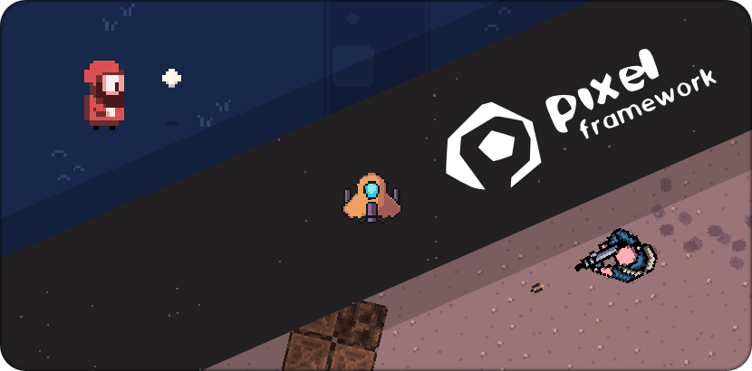

 

## Pixel Framework ##

### What is this repository for? ###

This repository contains the Pixel Framework and associated modules/dependencies.

### Description ###

The Pixel Framework aims to provide a high performance and lightweight OpenGL 2D game development workflow. It is
influenced by the popular XNA framework and is built on top of the [LWJGL](https://www.lwjgl.org/)
and [GLFW](https://www.glfw.org/) projects.

> :book: For practical details on how to use this framework, please check the [wiki page](https://github.com/joafalves/pixel-community/wiki).

Pixel is designed to be modular and easy to extend. Check 
[here](https://github.com/joafalves/pixel-community/wiki/E.-Extensions-Overview) for more details on how to use the 
available extensions (or how to create your own).

### Examples ##

Check the :file_folder: [demos folder](https://github.com/joafalves/pixel-community/tree/devel/demos) for examples.

##### Basic example (Drawing a Sprite) #####

```java
public class SingleSpriteDemo extends GameWindow {

    private Camera2D gameCamera;
    private ContentManager content;
    private SpriteBatch spriteBatch;

    private Texture spriteTex;

    public SingleSpriteDemo(GameWindowSettings settings) {
        super(settings);
    }

    @Override
    public void load() {
        // load up of resources and game managers/utilities
        gameCamera = new Camera2D(this);
        content = ContentManagerFactory.create();
        spriteBatch = SpriteBatchFactory.create(this);

        // example of loading a texture into memory:
        spriteTex = content.load("<texture_path>", Texture.class);
    }

    @Override
    public void update(DeltaTime delta) {
        // game update logic goes here
    }

    @Override
    public void draw(DeltaTime delta) {
        // begin the spritebatch phase:
        spriteBatch.begin(gameCamera.getViewMatrix(), BlendMode.NORMAL_BLEND);

        // sprite draw/put for this drawing phase:
        spriteBatch.draw(spriteTex, Vector2.ZERO, Color.WHITE);

        // end and draw all sprites stored:
        spriteBatch.end();
    }

    @Override
    public void dispose() {
        content.dispose();
        spriteBatch.dispose();
        super.dispose();
    }
}
```

> Looking for ECS support? Check [this built-in extension!](https://github.com/joafalves/pixel-community/wiki/E1.-ECS-(Entity-Component-System))

### Project structure ###

The framework functionality is divided into multiple modules which can be imported individually as required.

##### Root directory structure #####

    .build/                         # Bundle .jar files (run 'bundle' gradle task)
    .demos/                         # Feature showroom and learning examples
    .extensions/                    # Extensions for the framework (optional)
        ├── ext-ecs                 # Entity component system extension
        ├── ext-ecs-extra           # ECS utility components
        ├── ext-ldtk                # LDTK extension
        ├── ext-log4j2              # Log4j2 extension
        └── ext-tween               # Tween extension
    .modules/                       # The principal modules of the framework
        ├── commons                 # Common utility classes
        ├── content                 # Common Content classes (Texture, Font, Audio, ...)
        ├── desktop                 # Desktop implementation of graphics, content, windowing and others
        ├── graphics                # Graphics API module
        ├── math                    # Math module (Vector, Matrix, ...)
        └── pipeline                # Generic Pipeline processing module
    .resources/
        └── images                  # Project resource images
    .build.gradle                   # Gradle build file
    .settings.gradle                # Gradle settings file

##### Inner module structure #####

    .modules/
        └── *module*                 # Presented file structure similar in all modules
            ├── build                # Module build directory
            │   ├── docs             # Generated documentation files (run 'javadoc' gradle task)
            │   └── libs             # Generated .jar files (run 'jar' gradle task)
            ├── src                  # Module Source folder
            │   ├── main             # Module Main Source classes
            │   └── test             # Module Test Source classes
            └── build.gradle         # Module Gradle build file (contains inner dependency definitions)

### Development requirements ###

- Java/JVM 17.x+
- Gradle 8.x+ (gradle wrapper available)

### Runtime OS compatibility ###

Pretty much the same as the [LWJGL](https://www.lwjgl.org/) dependency, which includes:

- Windows (x86, x64, arm64)
- MacOS (x64, arm64)
- Linux (x86, x64, arm64, arm32)

> Requires OpenGL 3.3+ support.

### FAQ ###

1. I'm unable to run Pixel on MacOS due to system error.
    - Add `-XstartOnFirstThread` as a java VM Option before running your project.
2. Is Pixel compatible with Kotlin?
    - Yes, Pixel is fully compatible with Kotlin. Check
      this [demo](https://github.com/joafalves/pixel-community/tree/devel/demos/kotlin) for an example.
3. Is Pixel available as a Maven dependency?
    - Yes, Pixel is available as a public Maven
      dependency. [Click here](https://github.com/joafalves/pixel-community/wiki/1.-Getting-Started) for more details on
      how to import using Maven or Gradle.
4. Is Pixel free?
    - Yes, Pixel is completely free to use and distribute as an application dependency.

### Who do I talk to? ###

* It's a bug or a feature request? [Please open an issue](https://github.com/joafalves/pixel-community/issues).
* Repo owner or moderator.
